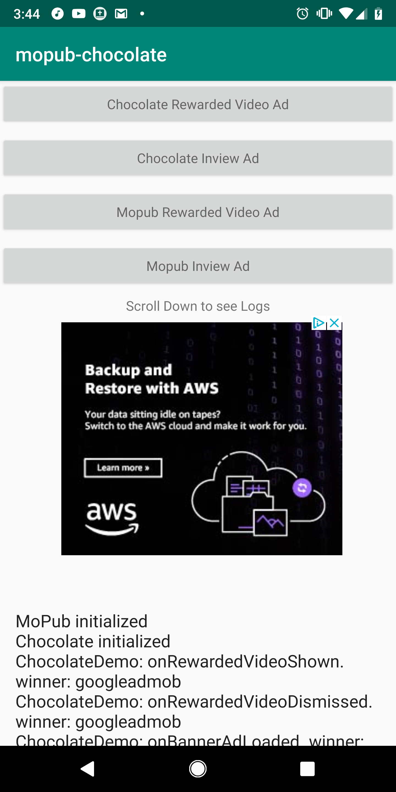
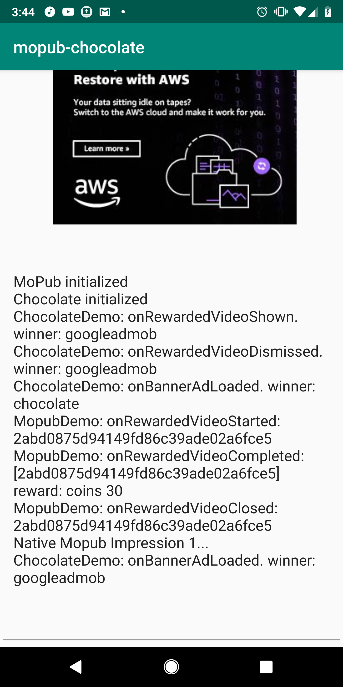

# mopub_chocolate
Shows Chocolate Mediation SDK and Mopub SDK working in the same app

Configure your ad units and keys in Config.java
When running the app, be sure to scroll down to see the running logs to see who is winning the auction.

Uses the latest Chocolate SDK:
https://chocolateplatform.com/sdk-documentation/?frame_ad_units=android

Also uses the latest Mopub SDK.

The magic is in app/build.gradle

 

